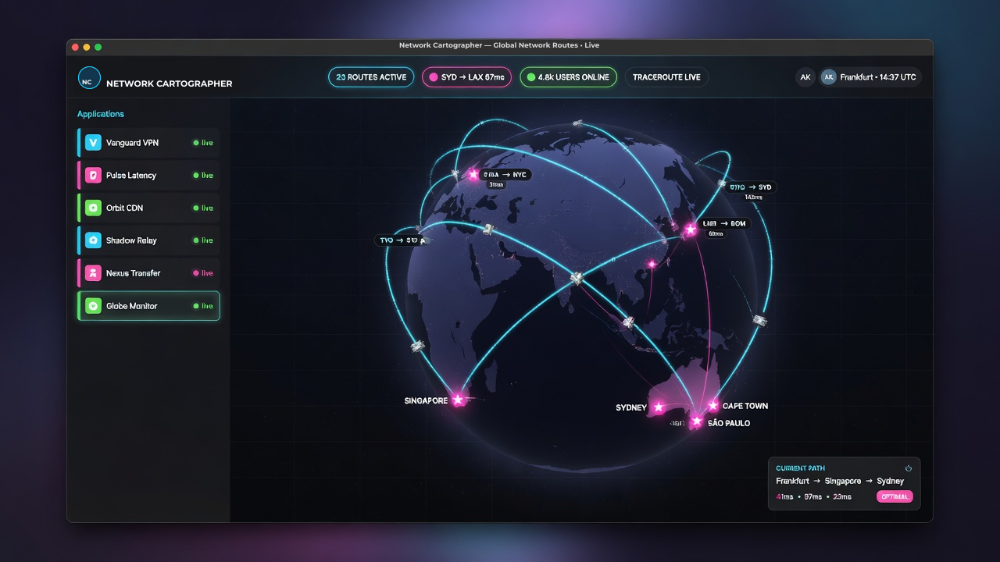

# Network Cartographer

Desktop app ([Tauri 2](https://v2.tauri.app/)) that shows **which applications** on your machine talk to the internet, **where** they connect, and **traceroute paths** to each remote host — on a live 3D globe.

Works on **Linux, macOS, and Windows**.

[](https://github.com/jonbng/network-cartographer/actions/workflows/ci.yml)
[](./LICENSE)

## Features

- Live list of apps with active TCP connections
- Destinations (IP / reverse-DNS hostname + port)
- Automatic background traceroutes (cached per IP, limited concurrency)
- **Hop geolocation** (rDNS / IATA codes + free GeoIP + latency consistency checks)
- **3D globe** path visualization ([Three.js](https://threejs.org/) / [globe.gl](https://globe.gl/))
- Filter, external-only toggle, local-geo mode, re-trace selected or all
- First-run privacy notice and About dialog (version + privacy summary)

## Screenshots



*Live globe with per-app path colors, hop cities, and connection sidebar.*

## Install (prebuilt)

Download the latest installer from **[GitHub Releases](https://github.com/jonbng/network-cartographer/releases)**.

| Platform | Assets |
|----------|--------|
| **Linux** | `.deb`, AppImage, optionally `.rpm` |
| **macOS** | `.dmg` (builds may be **unsigned** — right-click → Open the first time, or allow in System Settings → Privacy & Security) |
| **Windows** | `.msi` / NSIS `.exe` (SmartScreen may warn until code signing is configured) |

Linux packages may list `traceroute` as a dependency. On Windows, `tracert` is built in. On macOS, `traceroute` is preinstalled.

After install, optional offline GeoIP (recommended) is described below.

## Develop

### Prerequisites

All platforms:

- [Rust](https://www.rust-lang.org/) **1.88+**
- [Node.js](https://nodejs.org/) 18+
- Tauri system dependencies: [Prerequisites](https://v2.tauri.app/start/prerequisites/)

**Linux (Debian/Ubuntu example)** — WebKitGTK, build tools, and `traceroute`:

```bash
sudo apt install libwebkit2gtk-4.1-dev build-essential curl wget file \
  libxdo-dev libssl-dev libayatana-appindicator3-dev librsvg2-dev traceroute
```

**macOS**

- Xcode Command Line Tools: `xcode-select --install`
- `traceroute` is preinstalled (BSD flags; Network Cartographer does not use Linux-only options)
- See Tauri’s [macOS prerequisites](https://v2.tauri.app/start/prerequisites/#macos)

**Windows**

- [MSVC C++ Build Tools](https://visualstudio.microsoft.com/visual-cpp-build-tools/) (Desktop development with C++)
- [WebView2](https://developer.microsoft.com/microsoft-edge/webview2/) (usually already installed on Windows 10/11)
- `tracert` is built into Windows
- See Tauri’s [Windows prerequisites](https://v2.tauri.app/start/prerequisites/#windows)

### Run

```bash
npm install
npm run tauri dev
```

### Build release

```bash
npm run tauri build
```

Installers land under `src-tauri/target/release/bundle/` (platform-dependent: `.deb`, `.rpm`, AppImage, `.dmg`, `.msi` / NSIS `.exe`, etc.).

For store-quality icons (`.icns` / `.ico`), generate from a square master PNG:

```bash
npm run tauri icon path/to/app-icon-1024.png
```

## Architecture

```
ui/                 Vite + TypeScript frontend + globe.gl
src-tauri/          Tauri v2 + Rust backend
  src/collect/      OS socket tables → process map
  src/model/        Aggregation by app / destination
  src/resolve/      Reverse DNS workers
  src/trace/        Traceroute queue + parsers
  src/geo/          Hop geolocation (rDNS, GeoIP, latency refine)
  src/monitor.rs    Background poll + geo warmer, emits events
  src/commands.rs   invoke() API for the UI
experiments/        Unsupported experiments (e.g. terminal globe) — not part of the desktop app
```

The frontend listens to `monitor-update` events and calls commands via `@tauri-apps/api/core` `invoke`.

### Geolocation methodology (simplified GeoTraceroute-style)

Not 100% accurate — backbone GeoIP is often wrong. The app:

1. Parses reverse DNS for IATA/airport codes and city names
2. Optionally uses a local **MaxMind GeoLite2-City.mmdb** if present on disk
3. Batch-looks up via [ip-api.com](http://ip-api.com/batch) (free tier is **HTTP-only**; up to 40 IPs/cycle)
4. Falls back to [ipwho.is](https://ipwho.is) when still missing
5. Boosts confidence when sources agree; scores with latency vs distance
6. Relocates implausible GeoIP hops (RTT too small / path oscillation)
7. Caches full geolocated paths so UI snapshots stay cheap

**Optional offline DB:** place `GeoLite2-City.mmdb` (and optional `GeoLite2-ASN.mmdb`) where Network Cartographer can find them, or set:

| Variable | Purpose |
|----------|---------|
| `NETWORK_CARTOGRAPHER_MMDB` | Absolute path to GeoLite2-City.mmdb |
| `NETWORK_CARTOGRAPHER_ASN_MMDB` | Absolute path to GeoLite2-ASN.mmdb |

With a MaxMind [license key](https://www.maxmind.com/en/accounts/current/license-key):

```bash
export MAXMIND_LICENSE_KEY=your_key
./scripts/update-geolite2.sh
```

| Location | Platforms |
|----------|-----------|
| Project root or `data/` (cwd / next to binary) | all |
| `~/.local/share/GeoIP/` | Linux (and other Unix) |
| `/usr/share/GeoIP/` or `/var/lib/GeoIP/` | Linux |
| `~/Library/Application Support/GeoIP/` or `…/network-cartographer/` | macOS |
| `%LOCALAPPDATA%\GeoIP\` or `%LOCALAPPDATA%\network-cartographer\` | Windows |
| `%USERPROFILE%\GeoLite2-City.mmdb` | Windows |

Do **not** commit MaxMind databases (they are gitignored; check MaxMind’s license).

### Traceroute quality

Methods depend on the OS (best successful path kept). Tuned for speed: 1 probe/hop where supported, short waits, max 20 hops, 6 concurrent workers, ~28s kill timeout.

| OS | Methods (in order) |
|----|--------------------|
| **Linux** | TCP/443 (`-T`, often needs root) → ICMP (`-I`) → UDP → `tracepath`; parallel probes (`-N 32`) |
| **macOS** | ICMP (`-I`) → UDP (BSD `traceroute`; no Linux-only `-T`/`-N`) |
| **Windows** | `tracert -d` (ICMP; `-6` when the target is IPv6) |

## Privileges

Process names and privileged traceroute methods work better elevated:

| OS | Tip |
|----|-----|
| Linux | `sudo` if many sockets show without pid, or for TCP/ICMP traceroute |
| macOS | Run as admin if process attribution is incomplete; ICMP may need privileges (UDP fallback still runs) |
| Windows | Run as Administrator if process names are often `unknown` |

## Privacy

- Monitoring is **local**: the app reads OS socket tables and process metadata on your machine.
- Connection lists and process names are **not** uploaded to a Network Cartographer backend.
- For map placement, **IP addresses** (hop / destination) may be sent to third-party GeoIP APIs (`ip-api.com`, `ipwho.is`) and reverse DNS may be queried.
- Free **ip-api.com** batch lookups use **HTTP** (not HTTPS); prefer a local GeoLite2 MMDB to avoid that path.
- Use a local GeoLite2 MMDB and/or the **Local geo** toggle to reduce or avoid online GeoIP calls.
- Free GeoIP services have their own terms and rate limits.
- A first-run privacy notice must be accepted before continuing (stored in app settings).

See also [SECURITY.md](./SECURITY.md).

## Limitations

- HTTPS URLs/paths are not visible (encrypted)
- UDP connection peers are not currently listed; the cross-platform collector only exposes local UDP binds
- Traceroute needs the OS tool installed
- Short-lived connections may be missed between polls
- Free GeoIP is rate-limited; offline MMDB avoids that
- Prebuilt macOS/Windows binaries may be unsigned until signing is configured

## Contributing

See [CONTRIBUTING.md](./CONTRIBUTING.md) and the [Code of Conduct](./CODE_OF_CONDUCT.md).

Issues and pull requests are welcome.

1. Fork and clone
2. `npm install` then `npm run tauri dev`
3. Keep changes focused; match existing style
4. Open a PR with a short description of *what* and *why*

## License

[MIT](./LICENSE) © Jonathan Bangert

Earth texture and third-party attribution: [docs/ATTRIBUTIONS.md](./docs/ATTRIBUTIONS.md).

## Changelog

See [CHANGELOG.md](./CHANGELOG.md).
